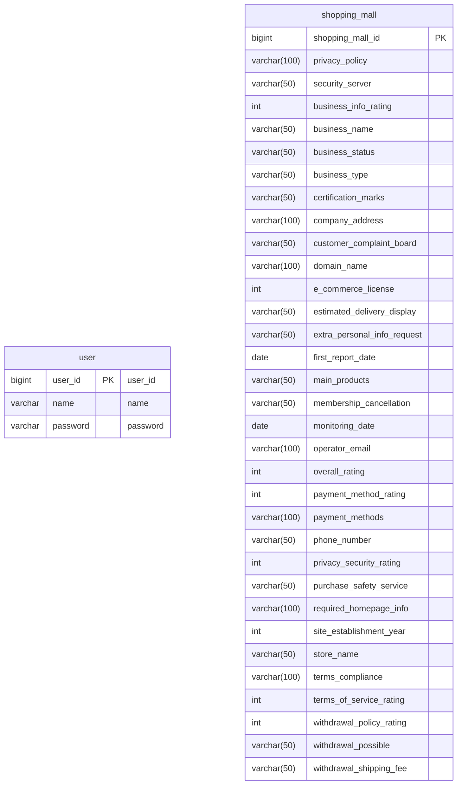

# 🛍️ 서울시 인터넷 쇼핑몰 현황 프로젝트

## ◽ 프로젝트 정보
- 서울시의 인터넷 쇼핑몰 현황을 조회할 수 있는 어플리케이션입니다. 조회 필터와 페이지네이션을 활용하여 업체 리스트를 확인할 수 있으며, 
CSV 파일을 업로드하여 데이터베이스에 저장할 수 있습니다.

## ◽ 주요 기능
  - 전체 평점, 업소 상태을 기준으로 한 업체 리스트 조회
  - Pageable 기반 업체 리스트 조회 
  - 커서 기반 페이지네이션을 활용한 업체 리스트 조회
  - API를 통해 CSV 파일 데이터를 데이터베이스에 저장

## 🔧 사용 기술
 

## ⏰ 프로젝트 기간
2025.01.31(금) ~ 2025. 02. 07(금)

## 🧑‍💻 팀원 소개
| 이름       | 역할   | 담당 업무                  |
|-----------|--------|-------------------------|
| 이현우      |  팀장 | PARSING, csv reader 구현| 
| 송준일      |  팀원 | 리팩토링 및 페이지네이션 구현 | 
| 김현준      |  팀원 | PARSING, csv reader 구현, 발표| 
| 김세희      |  팀원 | 리팩토링 및 페이지네이션 구현| 
| 이상구      |  팀원 | PARSING, csv reader 구현 | 

## 🔗 와이어 프레임
[와이어프레임 링크](https://www.figma.com/design/UySlhnO7ms1JIkzTnLWcys/Untitled?node-id=0-1&p=f&t=CYbweDT8ESu0w3OI-0_)

## 💻 ERD

## 📑 API 명세서
### 1. 회원 관련 API 
  - /auth<dr>
#### AuthController
| 기능       | Method   | URL              | Request | Response |
|-----------|----------|------------------|---------|--------|
| 회원 가입    | `POST`  | /auth/sign-up    | Body   | 201 Create | 
| 로그인      | `POST`  | /auth/log-in      | Body    | 200 OK |

### 2. 쇼핑몰 관련 API
- /shopping-mall<dr>
#### ShoppingMallController
| 기능       | Method   | URL              | Request | Response |
|-----------|----------|------------------|---------|--------|
| 전체 평점 및 업체 상태 리스트 조회   | `GET`  | /shopping-mall/status-ratings   | param   | 200 OK | 
| 페이지네이션 적용 리스트 조회 | `GET`  | /shopping-mall/status-ratings/page/{page}     | param    | 200 OK | 
| 커서 기반 페이지네이션 적용 리스트 조회| `GET`  | /shopping-mall/status-ratings/cursor-page   | param    | 200 OK |
| CSV 파일 업로드 및 데이터 저장    | `POST`  | /shopping-mall/collection    |     | 200 OK | 

## 📜 트러블 슈팅
- [CSV파일 한글 깨짐 현상](https://wax-drop-ff7.notion.site/CSV-193f00cdce4c80cc810fee84e97d2b42)
- [‘MysqlDataTruncation’ 오류 해결 과정](https://wax-drop-ff7.notion.site/MysqlDataTruncation-193f00cdce4c8061a26ad1c43691c5d4)

## 🖱️ 최적화
- [커서 기반 페이지네이션 API 최적화](https://wax-drop-ff7.notion.site/193f00cdce4c8090a796d7e97d7b76a3)

 
